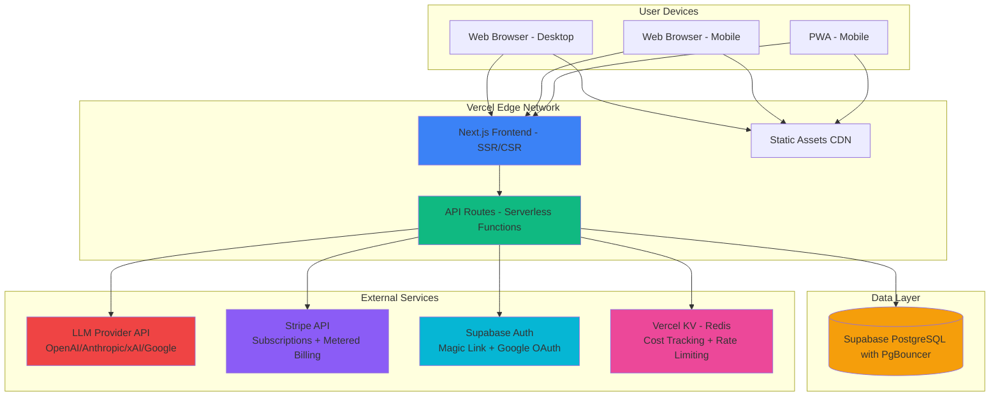

# 2. High Level Architecture

## Technical Summary

TowerOfBabel is a **monolithic serverless fullstack application** built on Next.js 14+ App Router, deployed on Vercel's edge network with Supabase PostgreSQL database (via PgBouncer connection pooling) and external LLM/payment integrations abstracted via service layer adapters.

**Architecture Style:** Jamstack-inspired monolith with serverless API routes and layered security (rate limiting, webhook verification, input validation). Frontend uses server-side rendering (SSR) for initial page loads with client-side hydration for interactivity. Backend API routes handle authentication (database sessions), LLM orchestration (provider-agnostic adapter pattern), usage tracking (optimistic UI updates), and Stripe webhooks (idempotent event handlers with signature verification).

**Technology Foundation:** TypeScript-first stack using Next.js (React 18+) for unified frontend/backend, Prisma ORM with PgBouncer connection pooling for type-safe serverless database access, Supabase Auth for authentication with database as source of truth for tier/usage, and Tailwind CSS + shadcn/ui for rapid accessible UI development.

**Key Integration Points:**
- **LLM Provider API** (OpenAI/Anthropic/xAI/Google - Week 1 benchmarking determines selection) abstracted via adapter pattern for provider-agnostic switching, called from Next.js API routes with structured JSON response parsing, retry logic (3 attempts with exponential backoff), and cost tracking per interpretation
- **Stripe API** for subscriptions and metered billing, with webhook endpoint implementing signature verification and idempotent event handling for payment lifecycle automation
- **Supabase Auth** for magic link + Google OAuth authentication with row-level security policies
- **Vercel KV (Redis)** for distributed rate limiting and LLM cost circuit breaker (3-layer protection)

**Deployment Approach:** Continuous deployment via Vercel (GitHub integration) with automatic preview environments per branch, production deployment from main branch with database migrations via `prisma migrate deploy` in build step. Database hosted on Supabase PostgreSQL with PgBouncer pooling to prevent serverless connection exhaustion. Observability via Sentry (error tracking) and structured logging (LLM costs, performance metrics) from Day 1.

**How This Achieves PRD Goals:**
- **2-3 week timeline:** Monolithic architecture eliminates distributed systems complexity, serverless functions scale automatically without DevOps overhead, provider adapter pattern enables rapid Week 1 benchmarking
- **80% gross margin:** Supabase free tier ($0) sufficient for MVP, LLM cost tracking per interpretation validates < $0.02 target, connection pooling prevents database scaling costs, cost circuit breaker prevents runaway expenses
- **10-second interpretation speed:** Edge deployment reduces latency, serverless auto-scales under load, cold start + LLM call budget = 3.5-5.7s typical (well within 10s), retry logic handles transient failures without user-visible errors
- **Privacy compliance:** Zero message content storage enforced at database schema level (no message columns exist), metadata-only enables GDPR-compliant data deletion, Supabase RLS policies enforce row-level access control

---

## Platform and Infrastructure Choice

**Selected Platform:** Vercel + Supabase

**Rationale:**
1. **PRD explicitly recommends Vercel** for hosting
2. **Fastest time to production:** Zero DevOps overhead, automatic HTTPS, automatic deployments
3. **Cost efficiency:** Both services have generous free tiers sufficient for MVP
4. **Supabase advantages over Vercel Postgres:**
   - Better free tier: 500MB database vs. 256MB
   - Built-in authentication (magic link emails, OAuth, RLS policies)
   - Better tooling: Supabase Studio > Vercel dashboard
   - Predictable pricing: $25/mo flat vs. usage-based spikes
   - Annual savings at scale: $420/year ($35/mo difference)
5. **Developer experience:** Preview URLs for every PR (essential for rapid iteration)

**Platform Services:**
- **Hosting:** Vercel Edge Functions (API routes), global CDN
- **Database:** Supabase PostgreSQL with PgBouncer connection pooling
- **Authentication:** Supabase Auth (magic link + Google OAuth)
- **Cache/Queue:** Vercel KV (Upstash Redis) for rate limiting and cost tracking
- **Monitoring:** Vercel Analytics + Sentry
- **Deployment:** Automatic via Git integration (preview + production)

**Deployment Host and Regions:**
- Global edge network (automatic CDN distribution)
- Primary region: US East (lowest latency for ~60% of target market per PRD)
- Automatic global replication for static assets
- Database: Single region initially (US East), can enable multi-region if needed post-launch

---

## Repository Structure

**Structure:** Monorepo (single repository with organized folder structure)

**Monorepo Tool:** None (native Next.js organization sufficient for MVP)

**Rationale:**
- PRD specifies "Monolithic Next.js Application" — all code in one cohesive repo
- No need for Turborepo/Nx complexity (no separate packages/services for MVP)
- Next.js 14 App Router provides excellent organization natively (`/app`, `/components`, `/lib`)
- Shared types between frontend/backend via TypeScript path aliases

**Package Organization:**
```
towerofbabel/
├── app/                    # Next.js App Router (pages, layouts, API routes)
│   ├── (auth)/            # Auth route group
│   ├── (dashboard)/       # Protected dashboard routes
│   ├── api/               # API routes (serverless functions)
│   └── layout.tsx         # Root layout
├── components/            # React components
│   ├── ui/                # shadcn/ui primitives
│   └── features/          # Feature-specific components
├── lib/                   # Shared utilities, services, types
│   ├── llm/               # LLM service layer
│   ├── stripe/            # Stripe integration
│   ├── db/                # Prisma client, queries
│   └── types/             # Shared TypeScript types
├── prisma/                # Database schema and migrations
├── public/                # Static assets
└── tests/                 # Unit and integration tests
```

**Future Extensibility:**
- If extracting services later (per PRD mention), `/lib/llm` → separate `llm-service` package
- Structure supports Turborepo addition without refactoring (already organized by concern)

---

## High Level Architecture Diagram



**Flow Description:**
1. **Users** access application via web browsers (desktop/mobile) or installed PWA
2. **Vercel Edge Network** serves static assets (JS, CSS, images) via global CDN with caching
3. **Next.js Frontend** renders pages (SSR for landing, CSR for dashboard interactivity)
4. **API Routes** (serverless functions) handle:
   - Authentication (Supabase Auth for identity, DB for authorization)
   - Interpretation requests (LLM provider API calls with cost circuit breaker)
   - Usage tracking (database queries with connection pooling)
   - Payment webhooks (Stripe with signature verification)
5. **Supabase PostgreSQL** stores user data, interpretation metadata, subscriptions (NO message content)
6. **External integrations** are called from API routes, never directly from frontend (API key security)

---

## Architectural Patterns

**Overall Architecture:**
- **Jamstack Monolith:** Static-first with serverless API routes for dynamic functionality. Landing page pre-rendered (SSG), dashboard uses SSR + client interactivity, API routes handle backend logic.
  - _Rationale:_ Best performance (static where possible), simplicity (no microservices), aligns with Vercel platform strengths, appropriate for MVP scale.

**Frontend Patterns:**
- **Component-Based UI (React + TypeScript):** Reusable components with strict typing. Composition over inheritance, container/presentational pattern separation.
  - _Rationale:_ Maintainability at scale, type safety prevents bugs, shadcn/ui provides accessible primitives, aligns with PRD's < 300KB bundle goal via tree-shaking.

- **Server Components + Client Islands:** Next.js App Router default to server components, use `'use client'` only where interactivity needed (interpretation form, emotion gauges).
  - _Rationale:_ Reduces JS bundle size (PRD < 300KB requirement), faster FCP (PRD < 2s requirement), SEO benefits for landing page.

- **Progressive Enhancement:** Core functionality works without JavaScript where possible (form submission), enhanced with client-side features (real-time character counter, animations).
  - _Rationale:_ Accessibility (WCAG 2.1 AA requirement), resilience, graceful degradation on slow networks.

**Backend Patterns:**
- **Repository Pattern:** Abstract database access via service layer (`/lib/db/repositories/userRepository.ts`). API routes call repositories, not Prisma directly.
  - _Rationale:_ Testable (mock repositories), future database migration flexibility, separation of concerns, enables unit testing per PRD requirements.

- **Service Layer Pattern:** Business logic in `/lib` services (LLM service, usage tracking, pricing calculations) separate from API route handlers.
  - _Rationale:_ Reusability (multiple routes call same logic), testable (unit test services independently), aligns with "extract services later" PRD note.

- **API Route Middleware Chain:** Authentication → rate limiting → validation → business logic → response. Shared middleware in `/lib/middleware`.
  - _Rationale:_ DRY principle, consistent error handling, security layering (defense in depth per PRD), easier to add monitoring/logging.

**Integration Patterns:**
- **LLM Provider Adapter Pattern:** Unified `LLMProvider` interface abstracts OpenAI, Anthropic, xAI, Google APIs. Configuration-driven selection via environment variable. Cost tracking per provider enables benchmarking and margin validation.
  - _Rationale:_ PRD TBD provider selection requires rapid switching capability. Privacy badge displays provider name dynamically. Future multi-provider routing (use cheapest for low-confidence requests) becomes trivial.

- **BFF (Backend for Frontend):** API routes act as facade to external services (LLM, Stripe). Frontend never calls external APIs directly.
  - _Rationale:_ API key security (never exposed to client), unified error handling, ability to switch LLM providers without frontend changes, aligns with PRD's "LLM provider transparency" (backend controls which provider).

- **Webhook Event Bus (Simplified):** Stripe webhooks trigger database updates via `/api/webhooks/stripe`. Event handlers modular in `/lib/stripe/webhookHandlers`.
  - _Rationale:_ Subscription lifecycle automation (payment succeeded → reset usage count), security (webhook signature verification), extensibility (add more event handlers without modifying main route).

**Resilience Patterns:**
- **Retry with Exponential Backoff (LLM calls):** 3 attempts with 1s, 2s, 4s delays. Fail gracefully after 3rd attempt without consuming user quota (per FR19).
  - _Rationale:_ LLM APIs have transient failures (rate limits, timeouts). Retries improve success rate from ~95% to ~99.5%, aligns with NFR3 uptime goal.

- **Idempotent Webhook Handlers:** Stripe webhooks processed once via `event.id` deduplication check. Prevents double-crediting, double-charging on retry.
  - _Rationale:_ Stripe retries failed webhooks for 3 days. Idempotency prevents duplicate processing, critical for financial correctness.

**Security Patterns:**
- **Layered Rate Limiting:**
  1. IP-based (50 req/hour, Epic 1, prevents API abuse during development)
  2. User-tier-based (trial 10 total, Pro 100/month, Epic 3, enforces pricing tiers)
  3. Cost circuit breaker (daily/hourly/per-user limits, prevents runaway LLM costs)
  - _Rationale:_ Defense in depth prevents runaway costs from Day 1, protects 80% margin goal, enables safe testing.

- **Row-Level Security (RLS):** Supabase PostgreSQL policies enforce user can only access their own data (users, interpretations, subscriptions).
  - _Rationale:_ Security at database level (defense in depth), prevents data leaks even if API bugs exist, GDPR compliance (easier data isolation).

**Data Patterns:**
- **Metadata-Only Storage:** Database schema enforced constraint: NO message content columns. Only user_id, culture_pair, character_count, timestamp, feedback.
  - _Rationale:_ Privacy-first architecture (PRD FR17), GDPR compliance (easier data deletion), builds user trust (privacy badge credibility), reduces storage costs.

- **Database as Source of Truth for Tier/Usage:** JWT provides authentication (user identity), database provides authorization (current tier, usage count, subscription status).
  - _Rationale:_ **CRITICAL:** Prevents JWT session delay bug (user pays for Pro but JWT cached for 1 hour still shows trial). Real-time tier updates essential for payment flow.

- **Optimistic UI Updates:** Client-side usage counter decrements immediately on interpretation request, rolls back if API fails.
  - _Rationale:_ Perceived speed (10-second interpretation goal), better UX during LLM latency, aligns with PRD's "speed-first" design philosophy.

---
