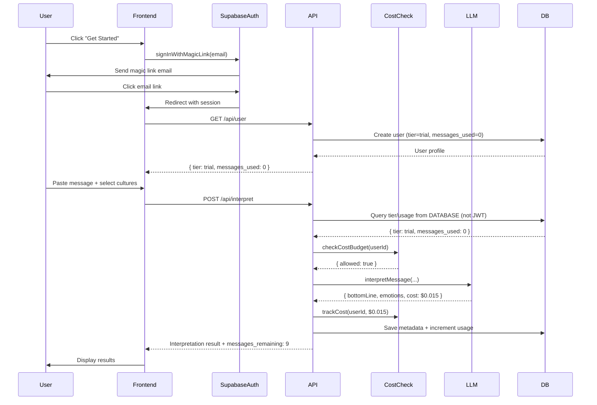
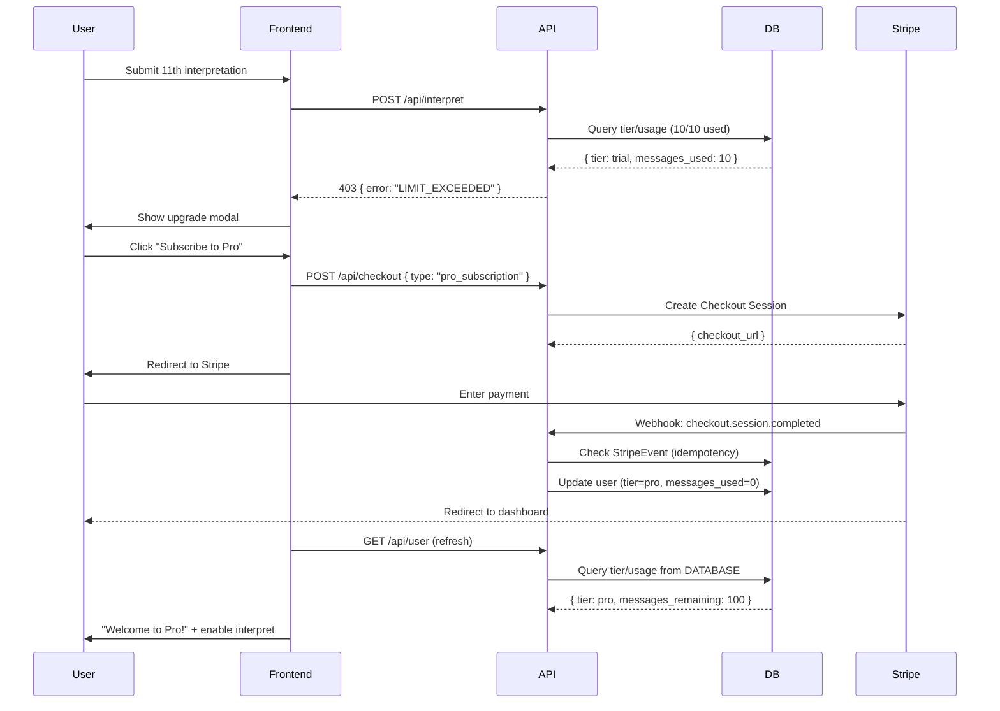

# 8. Core Workflows

## Workflow 1: First-Time User Sign-Up → First Interpretation

```mermaid
sequenceDiagram
    participant User
    participant Frontend
    participant SupabaseAuth
    participant API
    participant CostCheck
    participant LLM
    participant DB

    User->>Frontend: Click "Get Started"
    Frontend->>SupabaseAuth: signInWithMagicLink(email)
    SupabaseAuth->>User: Send magic link email
    User->>SupabaseAuth: Click email link
    SupabaseAuth->>Frontend: Redirect with session
    Frontend->>API: GET /api/user
    API->>DB: Create user (tier=trial, messages_used=0)
    DB-->>API: User profile
    API-->>Frontend: { tier: trial, messages_used: 0 }

    User->>Frontend: Paste message + select cultures
    Frontend->>API: POST /api/interpret
    API->>DB: Query tier/usage from DATABASE (not JWT)
    DB-->>API: { tier: trial, messages_used: 0 }
    API->>CostCheck: checkCostBudget(userId)
    CostCheck-->>API: { allowed: true }
    API->>LLM: interpretMessage(...)
    LLM-->>API: { bottomLine, emotions, cost: $0.015 }
    API->>CostCheck: trackCost(userId, $0.015)
    API->>DB: Save metadata + increment usage
    API-->>Frontend: Interpretation result + messages_remaining: 9
    Frontend->>User: Display results
```

---

## Workflow 2: Trial Limit Exceeded → Upgrade to Pro

```mermaid
sequenceDiagram
    participant User
    participant Frontend
    participant API
    participant DB
    participant Stripe

    User->>Frontend: Submit 11th interpretation
    Frontend->>API: POST /api/interpret
    API->>DB: Query tier/usage (10/10 used)
    DB-->>API: { tier: trial, messages_used: 10 }
    API-->>Frontend: 403 { error: "LIMIT_EXCEEDED" }
    Frontend->>User: Show upgrade modal

    User->>Frontend: Click "Subscribe to Pro"
    Frontend->>API: POST /api/checkout { type: "pro_subscription" }
    API->>Stripe: Create Checkout Session
    Stripe-->>API: { checkout_url }
    Frontend->>User: Redirect to Stripe

    User->>Stripe: Enter payment
    Stripe->>API: Webhook: checkout.session.completed
    API->>DB: Check StripeEvent (idempotency)
    API->>DB: Update user (tier=pro, messages_used=0)
    Stripe-->>User: Redirect to dashboard

    Frontend->>API: GET /api/user (refresh)
    API->>DB: Query tier/usage from DATABASE
    DB-->>API: { tier: pro, messages_remaining: 100 }
    Frontend->>User: "Welcome to Pro!" + enable interpret
```

---
